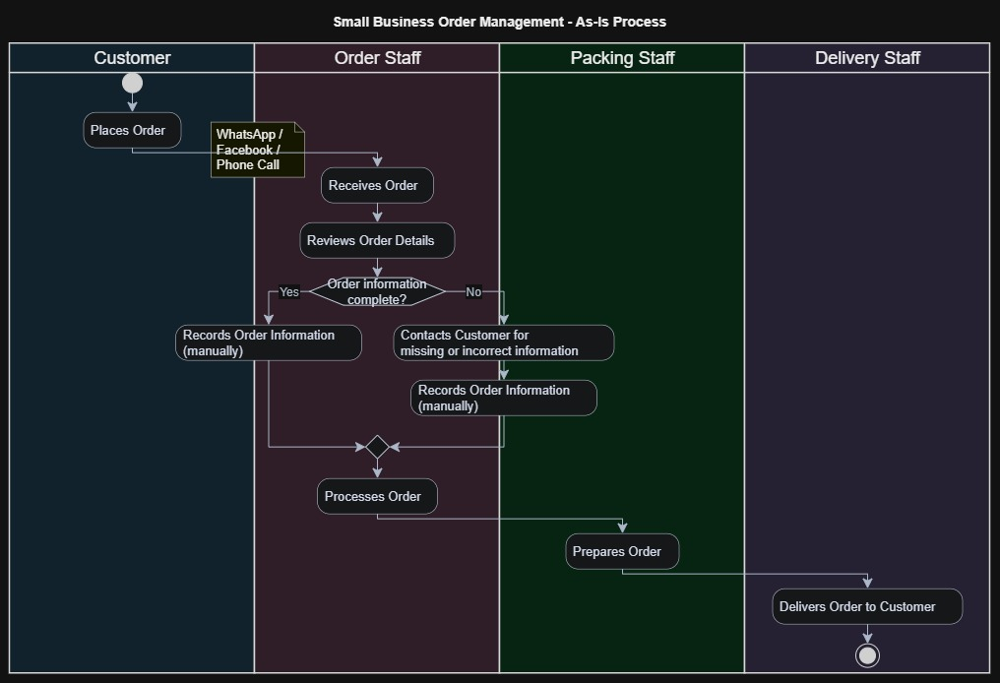

# As-Is Process Analysis

## 1. Purpose

This document describes the current-state order-management process of the
small business.

The purpose of the As-Is analysis is to understand how customer orders are
currently received, recorded, processed, and completed, and to identify
existing pain points and process gaps.

The process represents the current understanding based on the initial
elicitation and problem analysis. Further stakeholder validation may be
required before treating the process as a confirmed current-state model.

---

## 2. Current Process Overview

Customers currently place orders through multiple communication channels,
including WhatsApp, Facebook, and phone calls.

Staff receive the orders through these different channels and manually manage
the order information before processing the orders.

This creates difficulties in maintaining a consistent and accurate view of
all incoming orders.

---

## 3. As-Is Process Flow

Customer places order
↓
Order is received through WhatsApp, Facebook, or phone call
↓
Order staff reviews the order details
↓
Order information is manually recorded
↓
Order is checked for completeness
↓
Order is processed
↓
Packing staff prepares the order
↓
Delivery staff handles delivery
↓
Order is completed

---

## 4. Detailed Process Steps

| Step | Actor | Current Activity | Information / Output |
|------|-------|------------------|----------------------|
| 1 | Customer | Places an order | Order details |
| 2 | Order Staff | Receives the order through available communication channels | Customer order information |
| 3 | Order Staff | Reviews the received order | Order details checked |
| 4 | Order Staff | Records order information | Recorded order |
| 5 | Order Staff | Checks whether required information is available | Complete / incomplete order |
| 6 | Order Staff | Resolves missing or incorrect information when required | Updated order information |
| 7 | Order Staff | Processes the order | Order ready for preparation |
| 8 | Packing Staff | Prepares the customer's order | Packed order |
| 9 | Delivery Staff | Delivers the order | Delivered order |
| 10 | Business | Completes the order | Completed order |

---

## 5. Current-State Pain Points

The initial analysis identified the following problems:

### Multiple Order Channels

Orders are received through multiple platforms and communication channels,
making it difficult for staff to maintain a consistent view of all orders.

### Order Information Errors

Orders may be missed or incorrectly recorded during the manual handling
process.

### Limited Customer Visibility

Customers have limited visibility into the progress of their submitted
orders.

### Manual Order Management

Staff need to manually collect, record, and manage order information.

### Additional Communication

Limited order visibility may result in customers contacting staff to ask
about the progress of their orders.

---

## 6. Process Gaps Identified

| Gap ID | Current-State Gap | Potential Impact |
|--------|-------------------|------------------|
| GAP-01 | Orders arrive through multiple channels | Difficult to maintain a consistent order view |
| GAP-02 | Order information may be manually recorded | Risk of missing or incorrect information |
| GAP-03 | Customer order status visibility is limited | Additional customer enquiries |
| GAP-04 | Order information is not centrally visible | Difficulties monitoring order progress |
| GAP-05 | Current exception handling is not clearly defined | Inconsistent handling of missing or incorrect information |

---

## 7. Current-State Questions Requiring Validation

The following information should be confirmed with stakeholders before
finalizing the As-Is process:

- How exactly are orders recorded after they are received?
- Is a notebook, Excel file, or another method used?
- Who is responsible for checking order details?
- How are duplicate orders identified?
- How are incorrect orders corrected?
- How is payment currently confirmed?
- When is an order considered confirmed?
- How are customers currently informed about order progress?
- How are cancellations handled?
- How are delivery failures handled?
- Who updates the order status?
- What happens when an order is missed?

---

## 8. Key Observation

The main issue identified from the current-state analysis is not simply
that the business lacks a system.

The deeper issue is that order information enters the business through
multiple channels and is manually managed, creating opportunities for
information loss, incorrect recording, and limited visibility.

The current process should therefore be validated with relevant stakeholders
before defining the future-state process or solution.

## 2. As-Is Process Diagram

The following swimlane diagram represents the current-state
order-management process and the responsibilities of the main
stakeholders involved.

