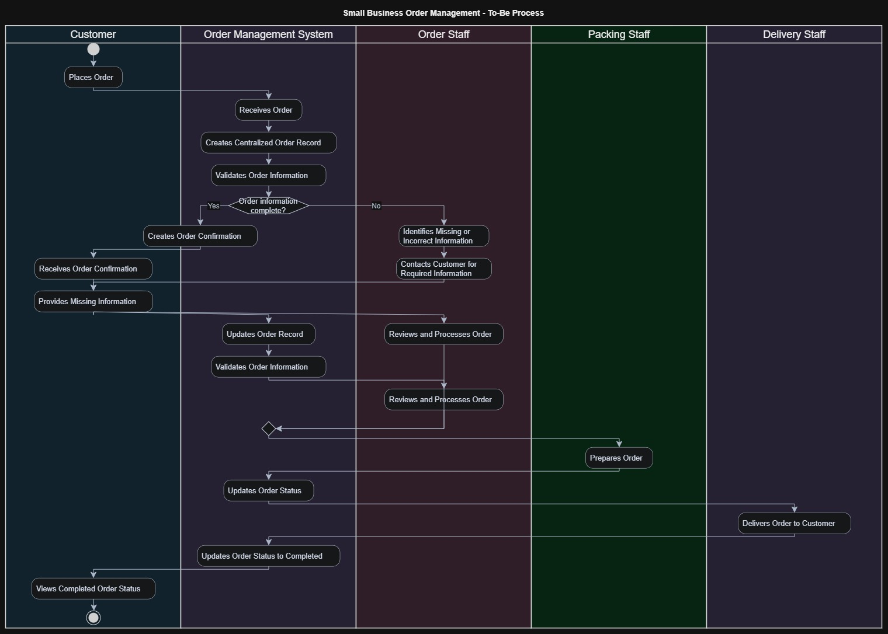

# To-Be Process Analysis

## 1. Purpose

The purpose of this document is to describe the proposed future-state
order-management process after addressing the key problems identified in
the current-state process.

The To-Be process focuses on improving order visibility, reducing manual
handling, improving order information accuracy, and providing customers
with better visibility of their order status.

The process represents a proposed future state based on the current
problem analysis and identified business requirements. Further validation
with stakeholders would be required before implementation.

## 2. Future-State Process Overview

In the proposed future state, customer orders are managed through a
centralized order-management process rather than relying primarily on
separate manual handling across multiple communication channels.

The proposed process introduces a centralized order record, validation
of order information, customer order confirmation, and order-status
visibility.

Order staff remain responsible for reviewing and processing orders,
while packing and delivery staff continue to perform their respective
operational activities.

## 3. To-Be Process Diagram

The following swimlane diagram represents the proposed future-state
order-management process and shows the responsibilities of the main
actors and the order-management system.

## 4. To-Be Process Flow

The proposed future-state process follows these major steps:

1. Customer places an order.
2. The order-management system receives the order.
3. The system creates a centralized order record.
4. The system validates the available order information.
5. If the information is incomplete, the required information is
   obtained from the customer.
6. Once the required information is available, the order record is
   updated.
7. The system provides an order confirmation.
8. Order staff review and process the order.
9. Packing staff prepare the order.
10. The order status is updated during the process.
11. Delivery staff deliver the order to the customer.
12. The order status is updated to completed.
13. The customer can view the completed order status.

## 5. Detailed To-Be Process Steps

| Step | Actor | Activity | Expected Outcome |
|------|-------|----------|------------------|
| 1 | Customer | Places an order | Order information is submitted |
| 2 | Order Management System | Receives the order | Order enters the centralized process |
| 3 | Order Management System | Creates an order record | Order information is stored centrally |
| 4 | Order Management System | Validates order information | Missing or incomplete information can be identified |
| 5 | Order Management System / Order Staff | Handles missing information | Required information is obtained or corrected |
| 6 | Order Management System | Updates the order record | Order information is maintained consistently |
| 7 | Order Management System | Provides order confirmation | Customer receives confirmation |
| 8 | Order Staff | Reviews and processes the order | Order is prepared for fulfilment |
| 9 | Packing Staff | Prepares the order | Order is ready for delivery |
| 10 | Order Management System | Updates order status | Current order progress is recorded |
| 11 | Delivery Staff | Delivers the order | Order reaches the customer |
| 12 | Order Management System | Updates status to completed | Order is recorded as completed |
| 13 | Customer | Views order status | Customer has visibility of order progress |

## 6. Improvements Addressed by the To-Be Process

### 6.1 Centralized Order Information

The proposed process introduces a centralized order record so that
order information can be managed consistently rather than being
maintained separately across different communication channels.

### 6.2 Improved Order Information Accuracy

The proposed validation step provides an opportunity to identify
missing or incomplete order information before the order proceeds
through the operational process.

### 6.3 Reduced Risk of Missed Orders

A centralized order-management process provides staff with a common
view of submitted orders, reducing the risk associated with manually
monitoring orders across multiple channels.

### 6.4 Improved Customer Visibility

The proposed process allows customers to view the current status of
their orders, reducing the need for customers to repeatedly contact
staff for basic status information.

### 6.5 Improved Process Monitoring

Order status updates provide staff and customers with greater
visibility into the progress of an order from submission through
completion.

## 7. To-Be Process Assumptions

The proposed future state is based on the following assumptions:

- A centralized order-management capability will be available.
- Customers will have a method of accessing their order status.
- Authorized staff will be able to review and process orders.
- Order information can be updated when corrections are required.
- Order status information can be updated during the fulfilment process.

These assumptions must be validated with relevant stakeholders before
the future-state process is finalized.

## 8. Future-State Validation Questions

The following questions should be discussed with stakeholders before
finalizing the To-Be process:

1. Which order channels should be supported by the future process?
2. What information must be provided before an order can be processed?
3. What should happen when required order information is missing?
4. What order statuses should be available?
5. Who should be authorized to update each order status?
6. How should customers access their order status?
7. When should customers receive order confirmations?
8. What should happen if an order needs to be cancelled or changed?
9. What should happen if a delivery cannot be completed?
10. What information should staff be able to see when managing orders?
11. What notifications should customers receive during the order
    lifecycle?
12. What business rules or restrictions should apply to order processing?

## 9. Expected Benefits

The proposed future-state process is intended to support:

- Improved order information consistency
- Reduced manual handling
- Better visibility of orders
- Reduced risk of missed or incorrectly recorded orders
- Improved customer visibility
- Better monitoring of order progress
- More structured coordination between staff involved in fulfilment

## 10. Relationship to Requirements

The To-Be process provides a process-level view of how the identified
business needs could be addressed.

The process will be used as an input for further Business Analysis
activities, including:

- Functional Requirements
- Non-Functional Requirements
- User Stories
- Acceptance Criteria
- Process and Business Rules
- Requirements Traceability

The future-state process should be validated and refined as additional
stakeholder information becomes available.

## 11. Key Observation

The main change between the current and future states is the movement
from a manually managed and fragmented order process toward a more
centralized and visible order-management process.

The To-Be process does not define the detailed technical
implementation. It describes the desired business process and
capabilities that the future solution should support.

## 2. To-Be Process Diagram

The following swimlane diagram represents the proposed future-state
order-management process and the responsibilities of the main
stakeholders and the order-management system involved.

